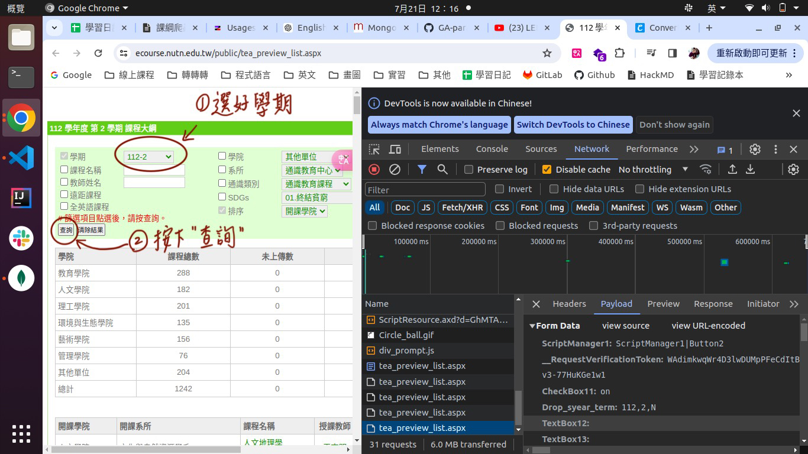
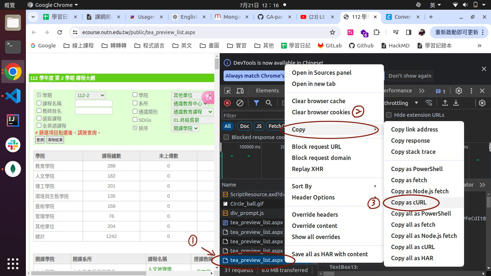
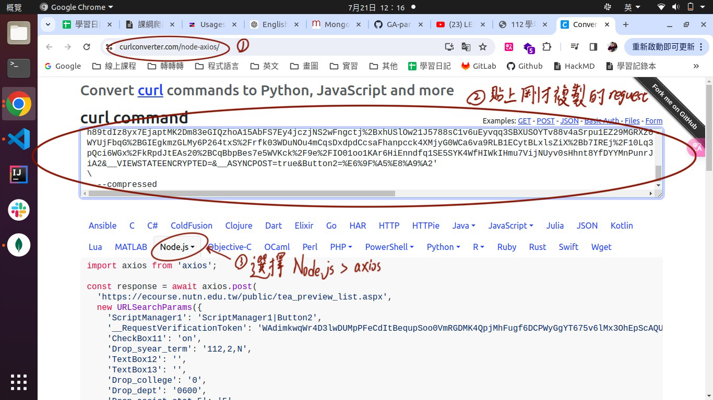
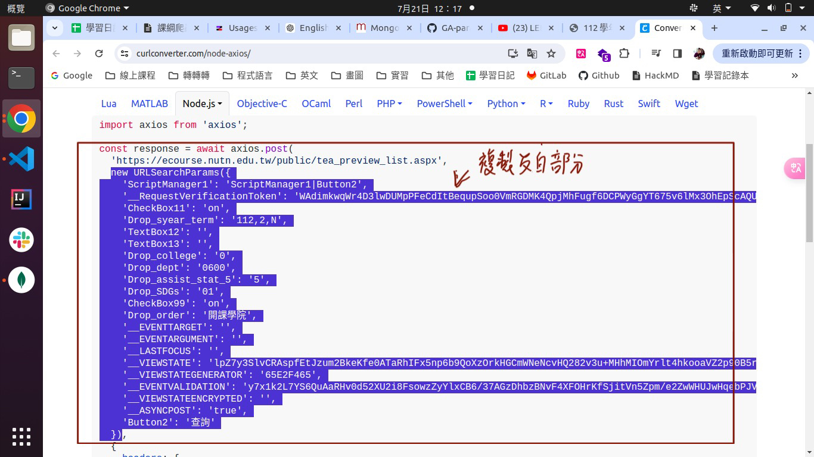
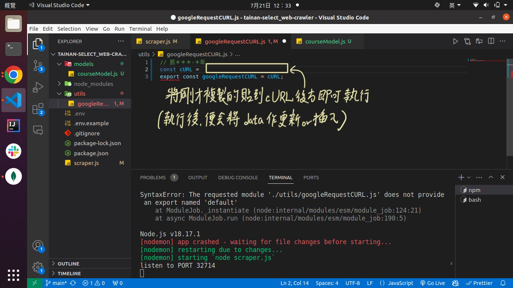

# Tainan Select 爬蟲
[Note](https://hackmd.io/@noz915/H1Ggmo1u0)

****

## Step 1
1. 選擇好要爬得學期
2. 記得按下「查詢」

## Step 2
1. 打開chorme devtool > Network > 找到剛剛按下「查詢」後發送的request
2. 對該request點擊右鍵 > copy > copy as cURL

## Step 3
1. 來到"[Convert curl to node.js](https://curlconverter.com/node-axios/)"
2. 將Step 2複製的cURL貼上
3. 選擇Node.js > axios（他就會將 chrome 發出去的 request 變成 node 程式碼，就可以直接拿來使用了）

## Step 4
複製下圖中反白的部份即可（也就是第二個參數）

## Step 5
回到專案的utils資料夾底下的googleRequestCURL.js檔案中，將Step 4複製的部份貼到cURL變數後方作為他的值。
執行後便會將該學期的課程大綱更新、插入至database中。

